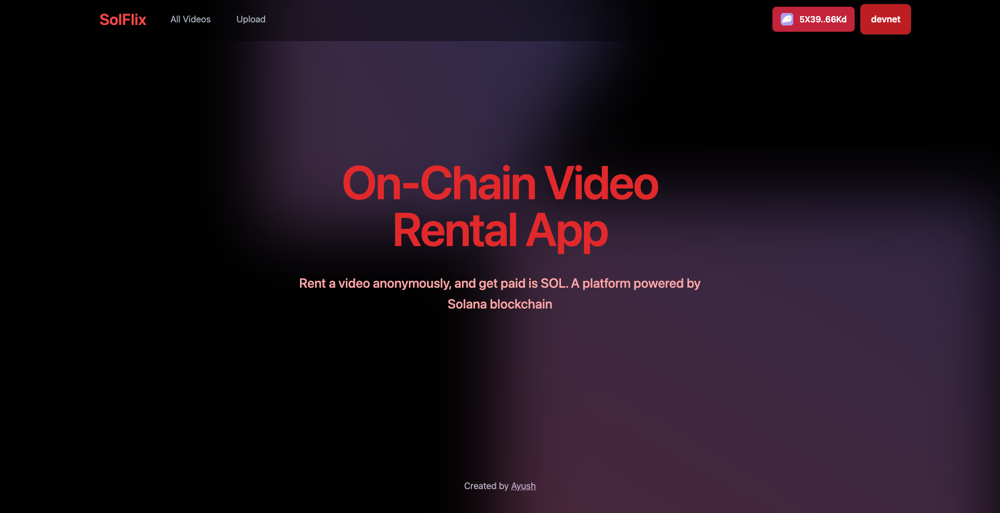

# Ayush's Web3 Portfolio

Hey 👋 there, Welcome 🙂

Ayush here, a software developer building full stack solana dApps using Anchor, Rust, React, Next.js, Node, Tailwind and Express.

Here are some of the web3 projects I build in my web3 journey and things I learned along the way : -

## SolFlix (Capstone Project)

<div align="">
 
</div>

> On-Chain Video Rental App

### Project Details

- **Website**: [Solflix](https://solflix-v.vercel.app/)
- **Pitch Deck**: [Slides](https://www.canva.com/design/DAGYDBsodR4/HPqWgCWfJQaox2bz4OmtlA/edit?utm_content=DAGYDBsodR4&utm_campaign=designshare&utm_medium=link2&utm_source=sharebutton)
- **Devnet Address**: [BFpFTmDwDNygSW9iL1UErkpDGTDiJFcjZh73DJ1vRu47](https://explorer.solana.com/address/BFpFTmDwDNygSW9iL1UErkpDGTDiJFcjZh73DJ1vRu47?cluster=devnet)
- **Program Repository**: [Program](https://github.com/ayushagarwal27/Solflix_Anchor_Rust)
- **Frontend Repository**: [Frontend](https://github.com/ayushagarwal27/solflix-frontend)

### Project Description

- SolFlix is a video rental dApp, where creator have autonomy to share videos anonymously, decide on validity of the video and price they would like to charge per video. (paid is SOL)

- Consumer have autonomy to have access to video in anonymous fashion and rent a video by paying direct to creator.

- This idea can be extended to share files and other media formats, without intervention of any intermediary.

---

## Program (Solana)

<hr/>

<details close>
<summary>  Vault Program</summary>
<br/>

A Solana program enabling users to create, deposit into, withdraw from, and close a user-specific account.

- User can open a vault, which will be system account unique to user
- User can deposit amount into vault
- User can withdraw amount from vault

Tech Stack : Anchor, Rust

- [Repo Link](https://github.com/ayushagarwal27/anchor_vault_solana)

</details>

<hr/>

<details close>
<summary>  Escrow Program</summary>
<br/>
A Solana program for holding funds until a condition is met for achieving a trustless conditional transfer.

#### Make Instruction

- Maker initializes escrow PDA,
- Maker creates vault PDA, whose authority lies with escrow
- Escrow contains information of token mint addresses and amount that needs to be exchanged

#### Refund Instruction

- Maker calls refund instruction for closing escrow and get a refund

#### Take Instruction

- Taker creates associated_token_account (ATA) for maker
- Taker transfers tokens to maker ATA
- Escrow transfers tokens from vault to taker ATA
- Escrow PDA is closed

Tech Stack : Anchor, Rust

- [Repo Link](https://github.com/ayushagarwal27/anchor_escrow_sol/tree/main)

</details>

<hr/>

<details close>
<summary> NFT Staking Program</summary>
<br/>

A Solana program for staking an NFT from a specific collection, earning points, and minting rewards.

#### Initialize User Instruction

- Creates user account PDA
- User account contains
  - points: reward points
  - amounts_staked: number of nft staked

#### Initialize Config Instruction

- Creates Config PDA
- Config PDA includes
  - points_per_stake: reward points per stake
  - freeze_period: period till which nft needs to be staked
  - max_stake: max number of nft that can be staked
  - rewards_bump: bump of rewards_mint
- Initialize Rewards Mint
- Only Admin can create config and reward_mint

#### Stake Instruction

- Creates Stake PDA
- Stake PDA includes
  - owner: owner of nft
  - mint: mint address of nft
  - stake_at: Unix time stamp when nft was staked
- Delegate Authority of Mint ATA to Stake Account
- Freezes Nft
- Increment user account staked nft by one

#### UnStake Instruction

- Checks elapsed time
- Increases the user reward points
- Unfreezes NFT
- Revokes delegation to Stake Account
- Decreases ft staked number by one

#### Claim Instruction

- Mint reward tokens to User Rewards ATA
- Makes user reward points to zero

Tech Stack : Anchor, Rust

- [Repo Link](https://github.com/ayushagarwal27/anchor-nft-staking-program/tree/main)
</details>

---

<details close>
<summary> Marketplace Program</summary>
<br/>
A Solana program where :

- admin can initialize marketplace
- maker can list their NFT,
- maker can delist their listed NFT,
- taker can purchase listed NFT

### State

Marketplace

```rs
pub struct Marketplace {
    pub admin: Pubkey,
    pub fee: u64,
    pub treasury_bump: u8,
    pub rewards_bump: u8,
    pub bump: u8,
    #[max_len(32)]
    pub name: String,
}
```

Listing

```rs
pub struct Listing {
    pub maker: Pubkey,
    pub mint: Pubkey,
    pub price: u64,
    pub bump: u8,
}
```

### Instructions

- Init: initilaizes the marketplace with pda with a specific name and related accounts by admin
- List: initilaizes the listing pda, transfer NFT from user's NFT ATA to Vault owned by Listing pda
- Purchase:
  - send price (sol) from taker to maker deducting marketplace fee,
  - transfer fee from taker to treasury of marketplace
  - send nft from vault of marketplace to taker ATA
  - close marketplace vault
- Delist:
  - send nft from marketplace vault to maker ata
  - close marketplace vault

Tech Stack : Anchor, Rust

- [Repo Link](https://github.com/ayushagarwal27/anchor_marketplace)
</details>

---

<details close>
<summary> AMM Program</summary>
<br/>
A Solana program where:  
- liquidity pool is created
- provider can deposit tokens
- user can swap tokens via the pool
- provider can withdraw tokens from pool

### State

```rs
pub struct Config {
    pub seed: u64, // used for creating different pools config
    pub authority: Option<Pubkey>, // if we want authority to lock config account
    pub mint_x : Pubkey, // TokenX
    pub mint_y: Pubkey, // TokenY
    pub fee: u16, // Swap fee in basis points
    pub locked: bool, // authority can lock a pool
    pub config_bump: u8, // seeds for config account
    pub lp_bump: u8 // bump seeds for LP token
}
```

### Instructions

- Initialize: Initialize liquidity mint, vaults for liquidity tokens, and lp pool config
- Deposit:
  - deposit liquidity tokens from user-ata to liquidity tokens-ata
  - mint lp tokens to user-lp-ata
- Swap:
  - deposit x token from user-ata-x to lp-vault-ata-x
  - withdraw y from lp-vault-ata-y to user-ata-y
- Withdraw:

  - withdraw tokens from lp pool vault to provider-ata
  - burn lp tokens owned by provider

- [Repo Link](https://github.com/ayushagarwal27/anchor_amm)
</details>

---

## DePiN (Capstone)

<details close>
<summary>Terrapulse</summary>

#### Project Highlights

- **Pitch Deck**: [Slides](https://www.canva.com/design/DAG18ZEog-s/RFQ8r3C1jb5x7OyA_eXG-A/edit?utm_content=DAG18ZEog-s&utm_campaign=designshare&utm_medium=link2&utm_source=sharebutton)
- **Devnet Address**: [EeLVcxJ4sG9Gj5bqsKbUG25KMsGrLSWcauKQwBUpCWRh](https://explorer.solana.com/address/EeLVcxJ4sG9Gj5bqsKbUG25KMsGrLSWcauKQwBUpCWRh?cluster=devnet)
- **Solana Program Repository**: [Program](https://github.com/solana-turbin3/TerraPulse-DePIN/tree/main/anchor)
- **Embedded Repository(Esp32)**: [Embedded](https://github.com/solana-turbin3/TerraPulse-DePIN/tree/main/esp32)
- **Frontend Repository**: [Frontend](https://github.com/solana-turbin3/TerraPulse-DePIN/tree/main/src)
- **Backend Repository**: [Backend](https://github.com/solana-turbin3/TerraPulse-DePIN/tree/main/src/app/api)

#### Project Description

TerraPulse is an on-chain-enabled network for environmental monitoring. It allows operators to host ESP32-based devices that collect environmental data (temperature, humidity, etc.) and post validated readings to the backend. Users earn on-chain rewards for validated contributions; rewards are synchronized on-chain using an Anchor program.

This repo implements three components:

1. Embedded (ESP32) — sensor code (DHT11), scheduling, WiFi provisioning via WiFiManager, and POST to backend API.
2. Frontend & Backend — Next.js app with pages for authentication, dashboard, claim flow, and server API routes to accept device data, manage devices/sensors, and sync rewards to the blockchain.
3. Anchor Program — simple reward accounting: initialize, initialize_user (per-user config), update_points (admin-driven), and claim (mint reward tokens to users).

</details>

---

## Ai-Agent / Bots

<details close>
<summary>Solana Ai Agent / Discord Bot</summary>
<br/>

An AI agent that provides token and swap information. Just provide mint address of tokens, amount and slippage

- Bot is active between 10:30 am - 12:30 pm (EST)
- Discord server [link](https://discord.gg/vQy9azja)

Tech Stack : Eliza framework, Jupiter APIs

- [Repo Link](https://github.com/ayushagarwal27/ai-agent-solana)

</details>
